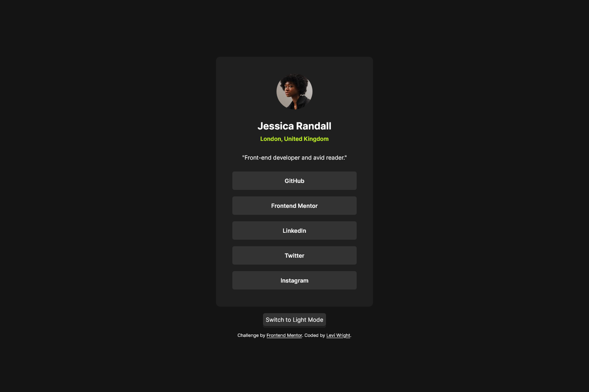
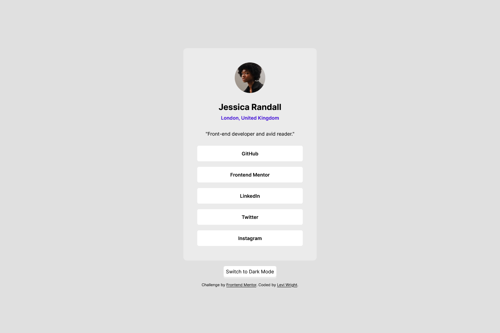

# Frontend Mentor - Social Links Profile Solution

This is a solution to the [Social Links Profile Challenge on Frontend Mentor](https://www.frontendmentor.io/challenges/social-links-profile-UG32l9m6dQ). Frontend Mentor challenges help you improve your coding skills by building realistic projects. 

## Table of Contents

- [Overview](#overview)
  - [The Challenge](#the-challenge)
  - [Screenshots](#screenshots)
  - [Links](#links)
- [My Process](#my-process)
  - [Built With](#built-with)
  - [What I Learned](#what-i-learned)
  - [Continued Development](#continued-development)
- [Author](#author)

## Overview

### The Challenge

Users should be able to:

- See hover and focus states for all interactive elements on the page

### Screenshots




### Links

- Solution URL: [Frontend Mentor](https://www.frontendmentor.io/solutions/social-links-profile-with-scss-and-light-mode-rb0p1G8wC1)
- Live Site URL: [GitHub Pages](https://law973.github.io/social-links-profile/)

## My Process

### Built With

- Semantic HTML
- CSS variables
- Flexbox
- SCSS
- JavaScript

### What I Learned

In order to create space between the links within the card, I used a general sibling selector (~) on the li elements. I'm not sure if I've ever used SCSS to nest combinators before, so that was a neat thing to try out.  

```css
li {
    list-style-type: none;

    ~ li {
        margin-top: 1rem;
    }
}
```

Also, I've started on trying to using rem values in place of pixels where appropriate (such as font sizes and margins), and made use of the font shorthand property to shorten up the code. 

```css
body {
    font: 400 0.875rem $font-stack;
    // font-family: $font-stack;
    // font-size: 0.875rem;
    // font-weight: 400;
}
```

### Continued Development

I would like to continue using rem units more often and learn more about how those and em units work.

## Author

- Website - [Levi Wright](https://leviwright.netlify.app/)
- Frontend Mentor - [@law973](https://www.frontendmentor.io/profile/law973)
- LinkedIn - [Levi Wright](https://www.linkedin.com/in/levi-arthur-wright/)
- GitHub - [@law973](https://github.com/law973)
